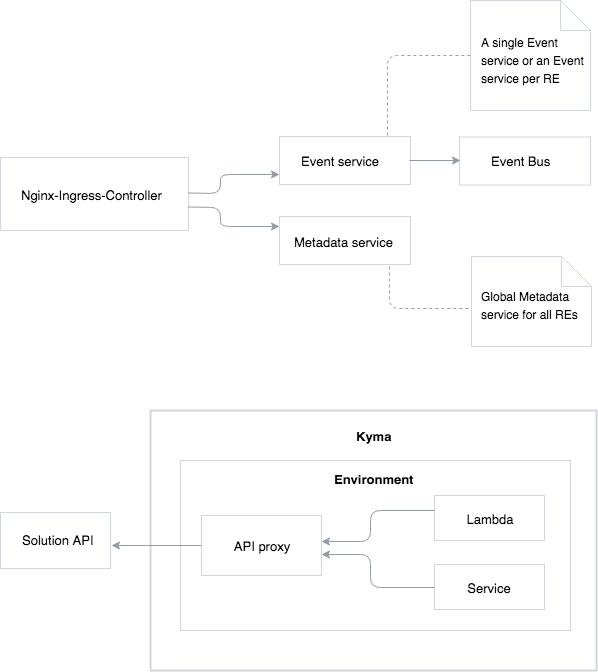

# ADR 016: Decomposition of the Application Connector

## Context

The Application Connector has three main areas of responsibility:

- Delivery of Events from the external solution to Kyma.
- Registration of Event Catalog and APIs exposed by the integrated solution.
- Proxying calls from Kyma to the external solution.

One big microservice, called the Gateway, implements all these three functionalities. The architecture introduced a technical debt. All functionalities require a different approach to scaling. Proxying the whole traffic over a single component is the introduction to a single point of failure.

## Decision

The decision is to split the Gateway service into three independent services:

- Event service
- Metadata service
- Proxy service

### Event service

The Event service will be extracted to a separate service. There will be single Event service per Remote Environment (per connected solution).

Nginx-Ingress will expose the Event service. It will also handle the security aspects.

### Metadata service

The Metadata service will be extracted to a separate service. There will be one global service which will handle the registration of APIs and the Event Catalog within all Remote Environments.

Nginx-Ingress will expose the Metadata service. It will also handle the security aspects. Proper path handling will ensure the separation between Remote Environments in Ingress.

### Proxy service

The Proxy service will be extracted to a separate service which will be integrated into the Service Catalog. The user will take care of triggering the deployment of this service. There will be a possibility to have one or many proxy services in the Environment.

## Status

Proposed

## Consequences

The separate proxy service will require integration with the Service Catalog. The security concept stays unchanged.
